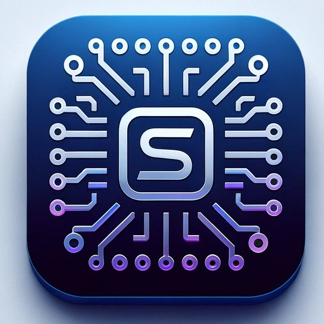

# Semiconductor Studio

# Guideline

2. [The purpose of this project](#2-the-purpose-of-this-project)
3. [What we are planning](#3-what-we-are-planning)
4. [What is done](#4-what-is-done)
   <!-- 5. [How to run](#6-how-to-run) -->
   <!-- 6. [How to modify and adjust to your needs](#7-how-to-modify-and-adjust-into-your-needs) -->

# The purpose of this project

The general purpose of this project is to write a tool for analyzing any p-n junction characteristic. We could separate the several modules.
Each module will be responsible for fitting one type of measurement. All source data and the fitted one would be stored in the relation server DataBase.
At the end of the journey, we want to add the AI assistant, which will help you to analyze data faster. Each module will have a set of automation; its range will be set in settings.

## Modules

**1. Junction Fit Master**

The module is responsible for fitting the I(V) curve based on the given model. In basic implementation, it would be a 4 and 6-parameter model. To get more information, check the dedicated page in the documentation about the JunctionFitMaster module. It will describe how to add your own model into the fitter and how to extend the numerical methods used in fitting.

<!-- **2.Something for A(T) and I0(T)** -->

<!-- **3. C(V) Wizard, Z(f) Master Mind, Walter CraftsMan** -->
<!-- **4. Quantum Efficiency** -->
<!-- **5. Fill Factor** -->

# What we are planning

**1. Junction Fit Master**
In the first official release, we want to have a quasi-full Junction Fit Master module. Based on the Monte Carlo simulation, it will contain a full fitting of the I(V) curve.
The fitting would be done for two basic models: 4 and 6-parameters (saturation current, ideality factor, series, parallel resistance, second parallel resistance, and alpha).
The local GPU computing will be available in the second release, but the server will be available in the third release.

# What is done

### Numeric Library

We are currently writing the numeric library, [Numeric Storm](https://github.com/SirJamesClarkMaxwell/NumericStorm/blob/main/).
We expect to publish the first release of the NumericStorm before the 13th of April. It will contain the basic Downhill Simplex implementation.
After that, we will start working on the Simulated Annealing Simplex algorithm.

<!-- # How to run -->

<!-- # How to modify and adjust to your needs -->
